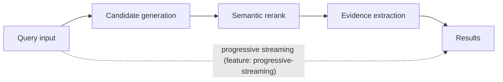
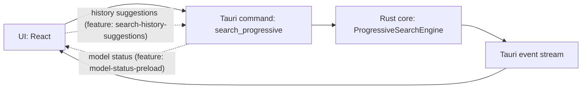
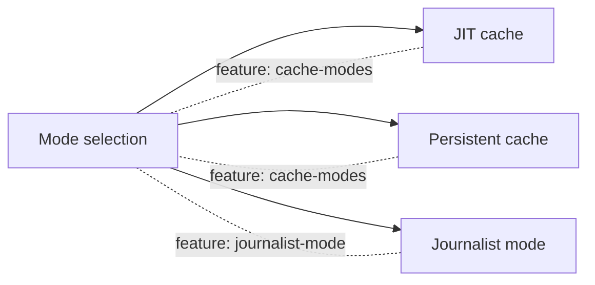

# Flow map

## Search pipeline (feature links)

```mermaid
flowchart LR
  Q[Query input] --> CG[Candidate generation]
  CG --> SEM[Semantic rerank]
  SEM --> EVID[Evidence extraction]
  EVID --> RES[Results]

  Q -. progressive streaming (feature: progressive-streaming) .-> RES
```

## Desktop IPC flow (feature links)

```mermaid
flowchart LR
  UI[UI: React] --> CMD[Tauri command: search_progressive]
  CMD --> CORE[Rust core: ProgressiveSearchEngine]
  CORE --> EVT[Tauri event stream]
  EVT --> UI

  CMD -. model status (feature: model-status-preload) .-> UI
  UI -. history suggestions (feature: search-history-suggestions) .-> CMD
```

## Cache modes and privacy (feature links)

```mermaid
flowchart LR
  MODE[Mode selection] --> JIT[JIT cache]
  MODE --> CACHE[Persistent cache]
  MODE --> JOURNALIST[Journalist mode]

  JIT -. feature: cache-modes .- MODE
  CACHE -. feature: cache-modes .- MODE
  JOURNALIST -. feature: journalist-mode .- MODE
```
